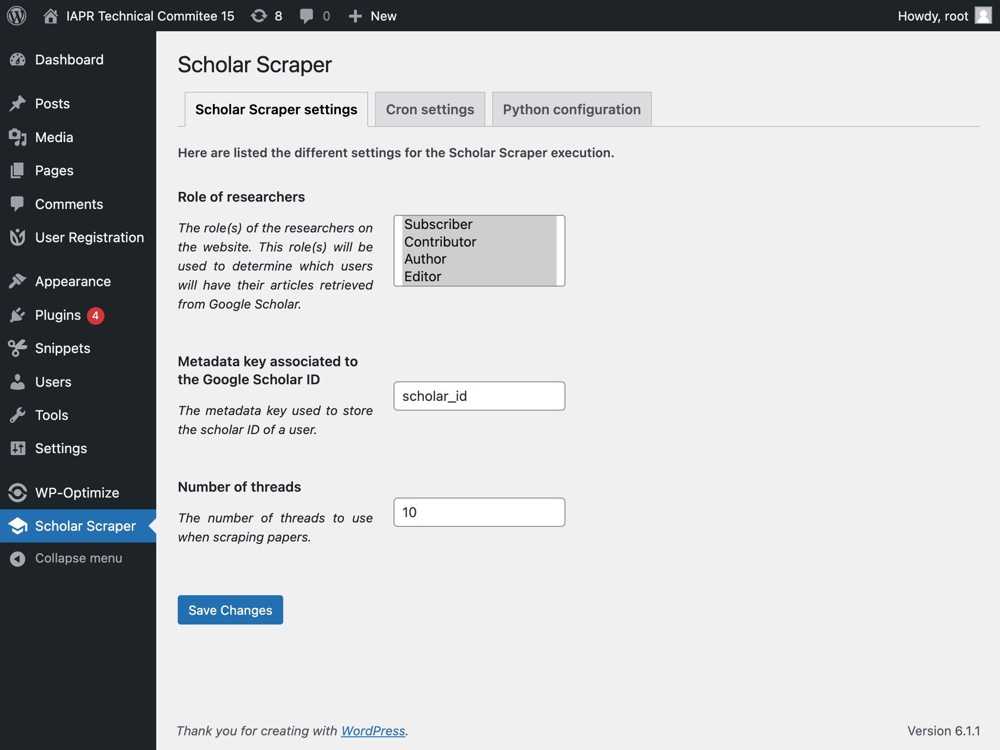
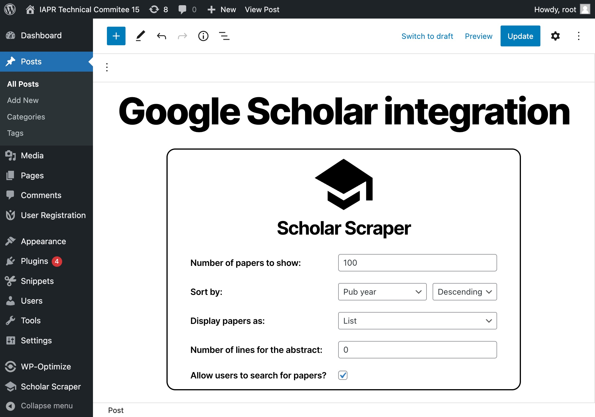
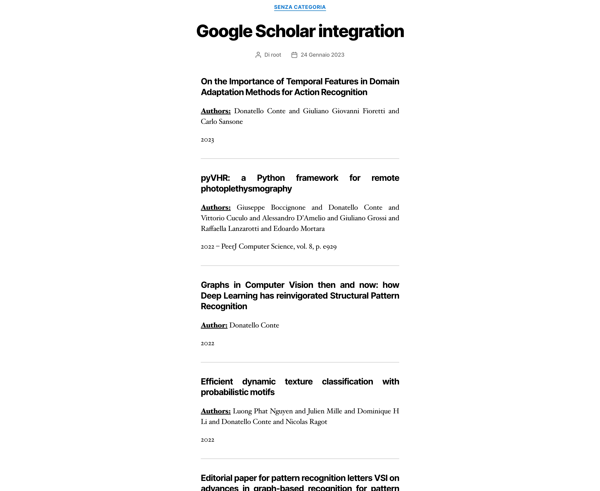
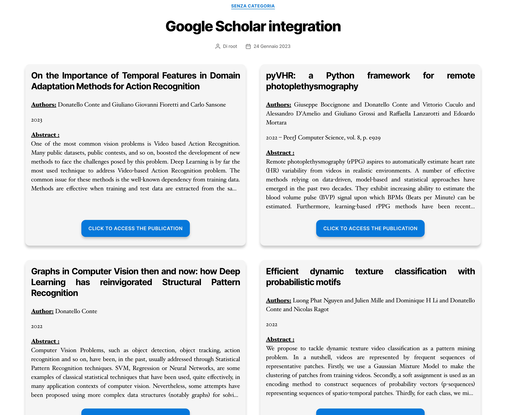

# Scholar Scraper - Wordpress Plugin

> A Wordpress plugin to scrape data from Google Scholar and display it on your website.

## What it is

This plugin allows you to scrape data from Google Scholar and display it on your website. \
It uses the [Scholar Scraper Python API][scholar-scraper-python-api] to fetch data in the background from Google
Scholar. \
The plugin is designed to be simple to use and customizable.

See the [User Guide][user-guide] for more information about the plugin and its usage. \
For the developers, see the [Developer Guide][developer-guide] for more information about the plugin's architecture.
You will also find some useful resources to help you enhance the plugin.

 

## Features

- Recurring background data fetching with the [Scholar Scraper Python API][scholar-scraper-python-api]
- Simple integration of Google Scholar papers using a Gutenberg block
- Customizable display of scraped data
- Search for papers by author, title, or keywords

 

## Overview

    

        
Configuration page

        
    

    

        
Integration of papers : the <code>Scholar Scraper</code> block

        
    

    

        
Results with the <code>List</code> display method

        
    

    

        
Results with the <code>Card</code> display method

        
    

<!-- References -->
[scholar-scraper-python-api]: https://github.com/guillaume-elambert/Scholar-Scraper-Python-API
[user-guide]: /user-guide/
[developer-guide]: /developer-guide/
