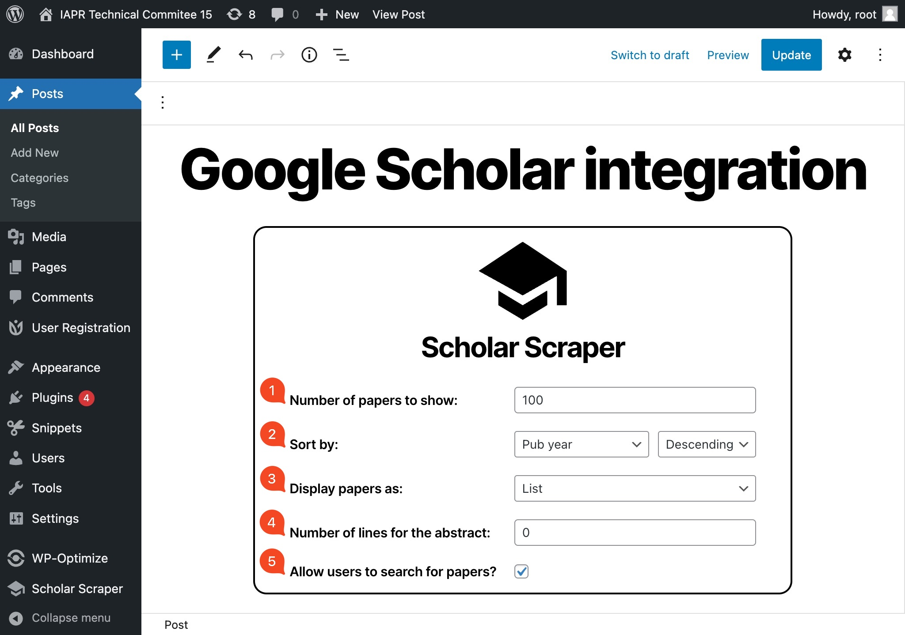

# Gutenberg Block Guide

This part of the documentation is dedicated to the Gutenberg Block.\
In this section, you will find all the information you need to use the Gutenberg Block.

## What is a Gutenberg Block?

A Gutenberg Block is a block of content that you can add to your WordPress page or post.\
The Gutenberg Block provided by the plugin allows you to display the Google Scholar papers of the users of your
WordPress website.

 

## How to add the Gutenberg Block to a page or post?

To add the Gutenberg Block to a page or post, you first need to install and configure the plugin
(see [Getting Started][getting-started]). \
Then, you can add the Gutenberg Block to a page or post. To do so, edit a page or a post, click on the `Add block`
button in the editor and search for `Scholar Scraper`. \
You should see the `Scholar Scraper` block in the search results. Click on it to add it to the page or post. \
You should see the Gutenberg Block in the editor. Like the following :

 

## Gutenberg Block options

As you may have noticed, the Gutenberg Block has a few options that you can configure. \
Those options are explained in the following table :

|              Number              |             Option name             | Description                                                                                                                                                                                                                                                                                                                                                                                         |
|:--------------------------------:|:-----------------------------------:|-----------------------------------------------------------------------------------------------------------------------------------------------------------------------------------------------------------------------------------------------------------------------------------------------------------------------------------------------------------------------------------------------------|
| :fa-solid circle-1 #f44823 1.25: |     `Number of papers to show`      | The number of papers to show in the page or post.                                                                                                                                                                                                                                                                                                                                                   |
| :fa-solid circle-2 #f44823 1.25: |              `Sort by`              | The field to use to sort the papers and the direction of the sort.                                                                                                                                                                                                                                                                                                                                  |
| :fa-solid circle-3 #f44823 1.25: |         `Display papers as`         | The display method to use to display the papers. For now there are two display methods : `List` and `Card`. To see the difference between the two display methods, see the [Block rendering](#block-rendering) section.                                                                                                                                                                             |
| :fa-solid circle-4 #f44823 1.25: | `Number of lines for the abstract`  | The number of lines to show for the abstract. The default value for the `List` display method is `0` and the default value for the `Card` display method is `6`. Those values are set independently and saved as a part of the Gutenberg Block, meaning that you can always change them without affecting the other display method.                                                                 |
| :fa-solid circle-5 #f44823 1.25: | `Allow users to search for papers?` | Whether or not to allow users to search for papers. If this option is enabled, a search bar will be displayed above the papers allowing users to search for papers. For now, the search is processed on : <ul style="margin-top:0;"><li>The paper title</li><li>The paper authors</li><li>The paper abstract</li><li>The paper publication year</li><li>The research fields of the author</li></ul> |

!> These options are saved for each `Scholar Scraper` Gutenberg Block, meaning that you can have multiple Gutenberg
Blocks across your website with different options for each one of them.

 

## Block rendering

After saving the Gutenberg Block, you can click on the `Preview` button to see how the block is rendered. \
The results will be displayed according to the options you have set. \
The following table shows the rendering of the Gutenberg Block depending on the display method you can choose.

    

        
Result with the <code>List</code> display method

        
    

    

        
Result with the <code>Card</code> display method

        
    

!> **<u>Note :</u>** The accent color used for the rendering of the Gutenberg Block is the same as the accent color of
your WordPress theme. \
In the example above, the accent color is `#0577da` (a light blue color).

!> **<u>Note :</u>** The display method where designed based on the [Twenty Twenty theme][wp-theme]. \
If you are using a different theme, the rendering may be different. \
If the rendering is not to your liking or if the display method is not working properly, consider following
the [Wordpress tutorial on how to customize your theme][wp-docs-customize-theme] or to go further, please refer to
the [Style section][dev-style-section] of the [Developer Guide][developer-guide]. #TODO !!

<!-- References -->
[getting-started]: /user-guide/getting-started
[developer-guide]: /developer-guide
[dev-style-section]: /developer-guide/style
[wp-theme]: https://wordpress.org/themes/twentytwenty/
[wp-docs-customize-theme]: https://learn.wordpress.org/tutorial/custom-css-in-the-editor/